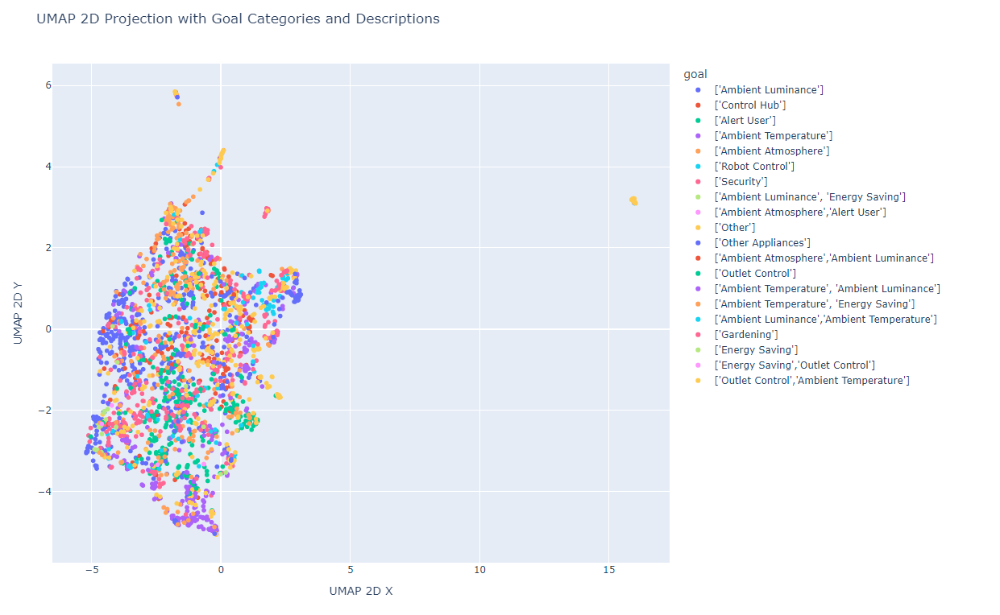
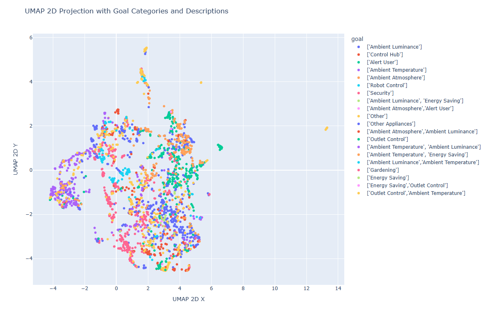
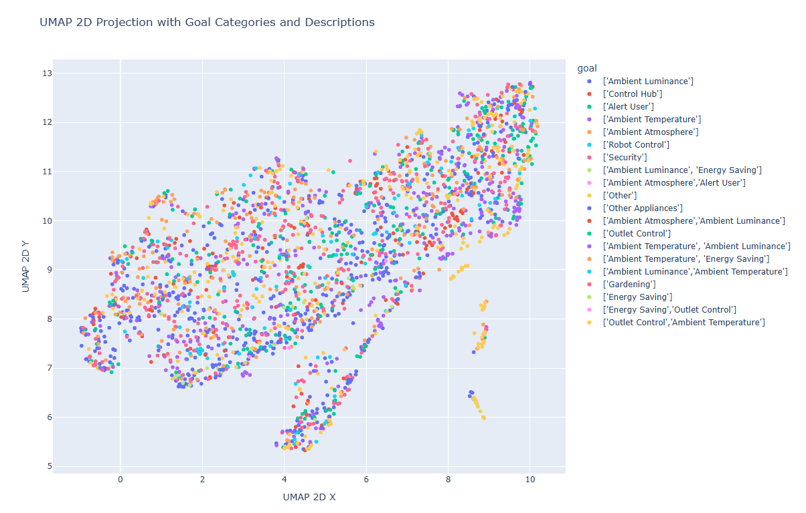

# User intention prediction for trigger-action programming rule

This repository takes inspiration from the paper "User intention prediction for trigger-action programming rule using multi-view representation learning" https://www.sciencedirect.com/science/article/abs/pii/S0957417424030653?via%3Dihub and want to build a representation model for user intention prediction in a TAP (Trigger-action programming) framework settings.

The task is a typical multilabel classification problem.

# Environment Setup

pip install -r requirements.txt

# Dataset
The reference dataset is the IFTTT If-This-Then-That dataset  (https://zenodo.org/records/5572861 also available on kaggle https://www.kaggle.com/code/hrs2kr/analysis-on-ifttt-dataset).
The main refernce file is the Step4_Single_Trigger_IoT_Rules.csv that contains the target column "goal".

# Approach
A step by step methodology oriented to clarity and pragmatism

-[01_dataset_analysis_and_preparation](01_dataset_analysis_and_preparation.ipynb) EDA analysis and some preprocessing steps 

-[02_text_embedding_creation_and_representation](02_text_embedding_creation_and_representation.ipynb) text embedding creation and UMAP representation

-[03_dataset_manipulation_for_multilabel_classification](03_dataset_manipulation_for_multilabel_classification.ipynb) produce a dataset suitable for a multilabel classification task 

## Modeling
Starting from a baseline model the aim of the project is to build AI models of increasing complexity to achieve the best performance scores.
- **Using only the textual representation of the rule  (text embeddings as features) and add a custom classifier on top**
  - [04_train_features_extractor](04_train_features_extractor.ipynb) train a classifier on top the embedding representation
  - [enhanced text] add other dataset columns to the "name" column
  - [embedding_model_finetuning] finetune the base embedding model with Contrastive Loss (class labels derived by the "goal")
- **Model Finetuning**  
   - [Only last layer]
   - [Some layers]
   - [PEF method eg LORA]
- **Decoder style LLM classificator**   
    - [Use prompting techniques to test an LLM as a classificator] Llama models for example
    - [Work with encoder style representation and decoder style] try to merge the two approaches
- **Graph Neural Network modeling**
    - [Create the graph representation and apply a GNN approach on this] extract the graph representation embeddings of the set of rules
- **Multi-view representation learning**   
    - [Representation Fusion] Merge different representation

# Results

|      | Approach   | Model    | Train Accuracy | Train F1-micro | Train F1-macro | Test Accuracy | Test F1-micro | Test F1-macro | 
| ---- | -----------| -------- | -------------- | -------------- | -------------- | --------------| ------------- | ------------- | 
|  1   |  Features extractor  |  bert-base-uncased + Logistic Regression   |  85.38%   |     0.92        |      0.94       |     52.60%       |    0.66      |     0.65     |
|  2   |  Features extractor  |  all-mpnet-base-v2 + Logistic Regression   |  73.59%   |     0.83        |      0.81       |     57.81%       |    0.71      |     0.69     |
|  3   |  Features extractor  |  ModernBERT-base + Logistic Regression   |  79.02%   |     0.88        |      0.88       |     47.14%       |    0.62      |     0.56     |

# UMAP 2d representations
### bert-base-uncased

### all-mpnet-base-v2

### ModernBERT-base

# Comments
## Features extractor Approach
From the representation of UMAP embeddings it is evident how the all-mpnet-base-v2 model is able to group in a stronger way textual representations of rules with the same goal. This better "clustered representation" helps the cascaded classifier which therefore obtains better results (test-set)